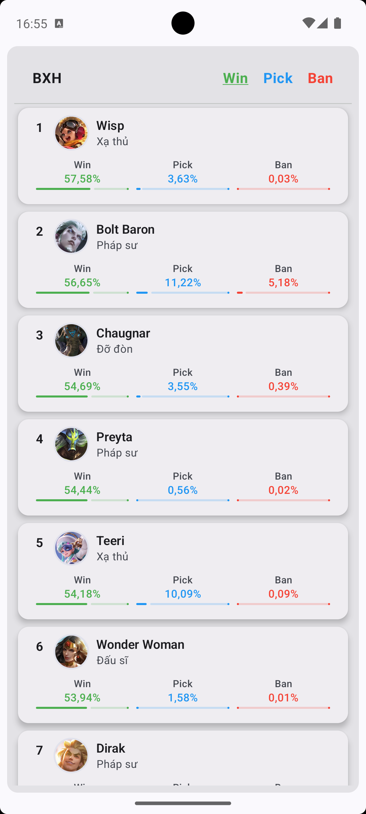
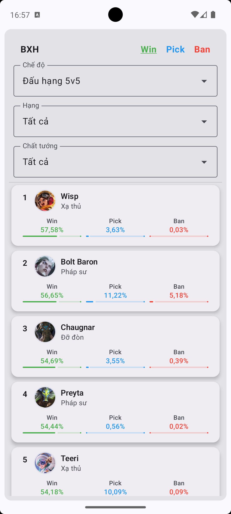

# AoV Hero Rate 📱🎮

A modern Android application that tracks win, pick and ban rates of heroes across multiple game modes and ranks in Arena of Valor (AoV) using Jetpack Compose and Kotlin.

|  |  |
|----------------------------------------|----------------------------------------|

## Features 🌟
- **Track** hero performance across different servers, game modes and ranks.
- **Dark Mode** for comfortable viewing.

## Tech Stack 🛠
- **Kotlin** - First class and official programming language for Android development.
- **Jetpack Compose** - Android's modern toolkit for building native UI.
- **Coroutines** - For asynchronous operations and more.
- **Koin** - For dependency injection.
- **Ktor Client** - A multiplatform HTTP client.
- **Room** - For caching frequently accessed data.

## Architecture 🏛

This app follows the MVI architectural pattern.

## Getting Started 🚀

1. **Clone** the repository:
```shell
git clone https://github.com/TrisTaam/AoV-Hero-Rate.git
```
2. Open the project in **Android Studio**.
3. Sync the Gradle files and run the app!

## License 📝

This project is licensed under the MIT License - see the [LICENSE](LICENSE) file for details.